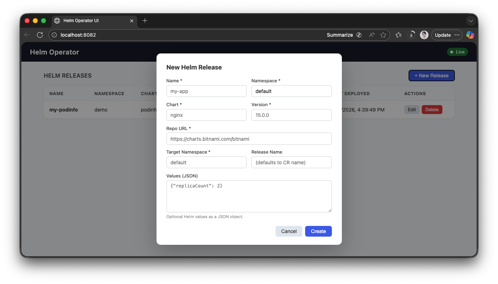

# Helm Operator

A Kubernetes Operator written in Go that installs, upgrades, and uninstalls Helm chart releases via a `HelmRelease` custom resource, with a built-in web UI.

Read [PROMPT.md](./PROMPT.md) to see the prompt that produced this code.

---

## Prerequisites

- Go 1.21+
- A running Kubernetes cluster (e.g. [kind](https://kind.sigs.k8s.io/), minikube, or any kubeconfig-reachable cluster)
- `kubectl` configured to point at the cluster
- `helm` CLI (for manual verification only)

## Quick Start

```bash
# 1. Install the CRD
kubectl apply -f config/crd/bases/helm.example.com_helmreleases.yaml

# 2. Run the operator locally (no Docker required)
go run ./main.go --leader-elect=false
```

The operator starts three listeners:

| Port | Purpose |
|------|---------|
| `:8080` | Prometheus metrics |
| `:8081` | `/healthz` and `/readyz` probes |
| `:8082` | Web UI |

Open **http://localhost:8082** to use the web UI.

---

## Deploy to Kind (local cluster)

This section covers building a Docker image, loading it into a local [Kind](https://kind.sigs.k8s.io/) cluster, and installing the operator with the Helm chart.

### Additional prerequisites

- [Docker](https://docs.docker.com/get-docker/)
- [`kind`](https://kind.sigs.k8s.io/docs/user/quick-start/#installation)
- `helm` CLI

### 1. Create a Kind cluster

```bash
kind create cluster --name helm-operator-demo
```

### 2. Build the Docker image

```bash
docker build -t helm-operator:v0.1.0 .
```

### 3. Load the image into Kind

Kind nodes cannot pull from the local Docker daemon automatically, so load the image directly:

```bash
kind load docker-image helm-operator:v0.1.0 --name helm-operator-demo
```

### 4. Install with Helm

```bash
helm install helm-operator ./chart \
  --namespace helm-operator \
  --create-namespace \
  --set image.tag=v0.1.0
```

The chart applies the CRD first (from `chart/crds/`), then deploys the operator Deployment, ServiceAccount, ClusterRole, and ClusterRoleBinding.

Verify the operator is running:

```bash
kubectl get pods -n helm-operator
# NAME                             READY   STATUS    RESTARTS   AGE
# helm-operator-7d9f6b8c4d-xq2pz   1/1     Running   0          30s
```

### 5. Access the web UI from your laptop

```bash
kubectl port-forward -n helm-operator svc/helm-operator-ui 8082:8082
```

Then open **http://localhost:8082**.

---

## Working Example — Deploy podinfo via HelmRelease

```bash
kubectl create namespace demo

kubectl apply -f - <<EOF
apiVersion: helm.example.com/v1alpha1
kind: HelmRelease
metadata:
  name: my-podinfo
  namespace: demo
spec:
  chart: podinfo
  repoURL: https://stefanprodan.github.io/podinfo
  version: "6.5.4"
  targetNamespace: demo
  values:
    replicaCount: 1
EOF
```

Watch the operator reconcile:

```bash
kubectl get hr -n demo -w
# NAME          CHART     VERSION   NAMESPACE   PHASE        AGE
# my-podinfo    podinfo   6.5.4     demo        Installing   2s
# my-podinfo    podinfo   6.5.4     demo        Ready        14s
```

### Tear down

```bash
helm uninstall helm-operator -n helm-operator
kind delete cluster --name helm-operator-demo
```

---

## Web UI

The operator embeds a single-page UI served on `:8082`. No separate deployment is required.




### Features

- **List** all `HelmRelease` resources across namespaces, with colour-coded phase badges
- **Create** a new release via a modal form
- **Edit** an existing release (chart, version, repo URL, values)
- **Delete** a release (the operator's finalizer ensures the Helm release is also uninstalled)
- **Live status updates** via Server-Sent Events — the table refreshes automatically as the operator reconciles changes

### Running with the UI

```bash
make run-ui          # equivalent to: go run ./main.go --leader-elect=false --ui-bind-address=:8082
```

To change the UI port:

```bash
go run ./main.go --leader-elect=false --ui-bind-address=:9090
```

---

## kubectl Usage

### HelmRelease spec

```yaml
apiVersion: helm.example.com/v1alpha1
kind: HelmRelease
metadata:
  name: <release-name>       # also the Helm release name unless releaseName is set
  namespace: <cr-namespace>  # namespace where this CR lives
spec:
  chart: <chart-name>        # required
  repoURL: <repo-url>        # required
  version: <chart-version>   # required — exact semver (e.g. "6.5.4")
  targetNamespace: <ns>      # required — where the Helm release is installed
  releaseName: <name>        # optional — overrides the Helm release name
  values: {}                 # optional — arbitrary Helm values
```

### Command reference

```bash
# List (short alias: hr)
kubectl get hr                                               # default namespace
kubectl get hr -A                                            # all namespaces
kubectl get hr -n demo -w                                    # watch for phase changes

# Create / update
kubectl apply -f helmrelease.yaml

# Inspect
kubectl describe hr my-podinfo -n demo                       # phase, conditions, revision
kubectl get hr my-podinfo -n demo -o yaml                    # full resource

# Upgrade — edit spec, operator reconciles automatically (Ready → Upgrading → Ready)
kubectl patch hr my-podinfo -n demo --type=merge -p '{"spec":{"version":"6.6.0"}}'
kubectl edit hr my-podinfo -n demo

# Delete — finalizer runs helm uninstall before CR is removed
kubectl delete hr my-podinfo -n demo

# Operator logs
kubectl logs -n helm-operator -l app.kubernetes.io/name=helm-operator -f

# Events for a specific release
kubectl events --for helmrelease/my-podinfo -n demo
```

---

## Project Structure

```
helm-operator/
├── README.md
├── PROMPT.md
├── Dockerfile                ← multi-stage build (distroless runtime)
├── main.go                   ← operator entry point
├── Makefile
├── go.mod / go.sum
├── api/v1alpha1/
│   ├── helmrelease_types.go  ← CRD schema
│   └── zz_generated.deepcopy.go
├── chart/                    ← Helm chart for deploying the operator
│   ├── Chart.yaml
│   ├── values.yaml
│   ├── crds/
│   │   └── helm.example.com_helmreleases.yaml
│   └── templates/
│       ├── _helpers.tpl
│       ├── serviceaccount.yaml
│       ├── clusterrole.yaml
│       ├── clusterrolebinding.yaml
│       ├── deployment.yaml
│       └── service.yaml
├── config/crd/bases/         ← generated CRD (source of truth)
├── controllers/
│   ├── helmrelease_controller.go  ← reconciler
│   └── helmclient.go              ← Helm SDK wrapper
├── docs/                     ← screenshots and assets
└── web/
    ├── server.go             ← HTTP server + SSE broker
    └── static/
        └── index.html        ← embedded single-page UI
```

---

## Makefile Targets

```bash
make build        # compile binary to bin/manager
make run          # run operator locally (leader election on)
make run-ui       # run with leader election off, UI on :8082
make test         # run unit + integration tests via envtest
make manifests    # regenerate CRD YAML
make generate     # regenerate DeepCopy methods
make fmt          # gofmt
make vet          # go vet
make docker-build # build Docker image (IMG=helm-operator:latest)
make docker-push  # push image to registry
make install      # kubectl apply CRDs
make deploy       # kubectl apply all manifests
```
